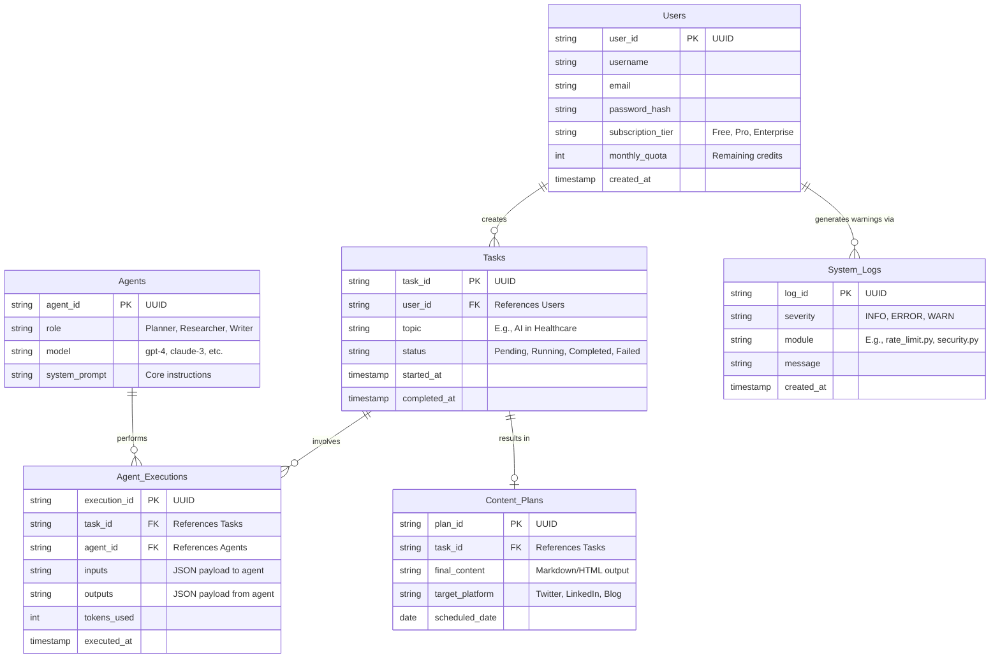
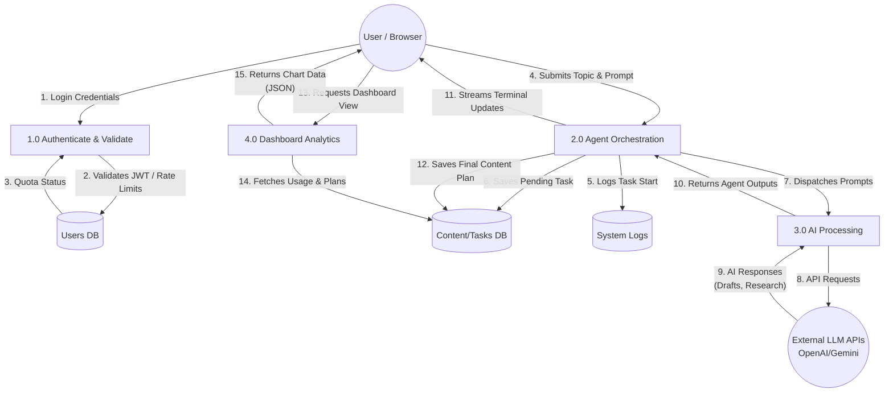

# Database & Data Flow Architecture (Stratify AI)

This document contains the detailed Entity Relationship Diagram (ERD) and Level 1 Data Flow Diagram (DFD) for the Multi AI Agent Content Planner.

These diagrams use Mermaid.js syntax. You can view them by installing a Markdown preview extension that supports Mermaid, or by pasting the code blocks into [Mermaid Live Editor](https://mermaid.live/).

---

## 1. Entity Relationship Diagram (ERD)

This diagram illustrates the core database tables and their relationships within the Stratify AI system.

### Table Details:

- **Users:** Manages authentication and billing/quotas (interacting with your `security.py` and `rate_limit.py`).
- **Tasks:** Represents a single user request to the Multi-Agent system (e.g., "Write a blog post about AI").
- **Agents:** Defines the available AI personalities/roles in the system.
- **Agent_Executions:** A join/audit table tracking exactly what each agent did for a specific task, useful for the real-time terminal (`AgentTerminal.jsx`).
- **Content_Plans:** The final, polished output ready for the user's dashboard.
- **System_Logs:** Centralized logging for the python backend (`logger.py`).

---

## 2. Level 1 Data Flow Diagram (DFD)

This diagram shows how data moves between external entities (the User, AI APIs), core processes, and data stores.

### Process Descriptions:

- **Process 1.0 (Authenticate & Validate):** Handled by `security.py` and `rate_limit.py` and `middleware.py`. Ensures the user has permissions and credits to run agents.
- **Process 2.0 (Agent Orchestration):** The core backend logic. It breaks down the user's prompt, assigns sub-tasks to different agents, and orchestrates the flow of data.
- **Process 3.0 (AI Processing):** The specific modules that make network calls to external APIs (OpenAI, Gemini) and parse the JSON responses.
- **Process 4.0 (Dashboard Analytics):** API endpoints that aggregate data to serve the visual charts in `RevenueAndUserCharts.jsx`.
