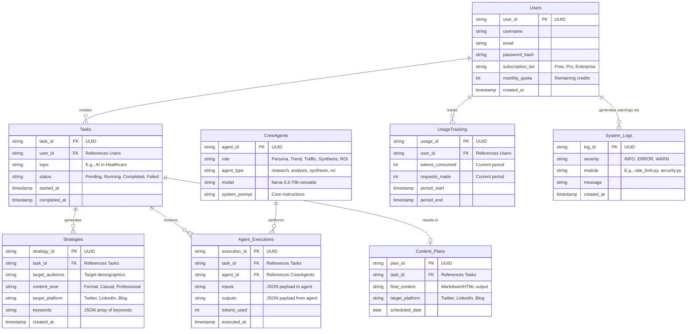
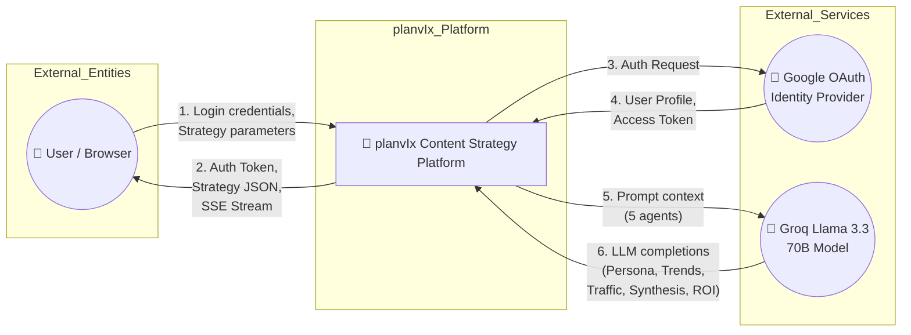
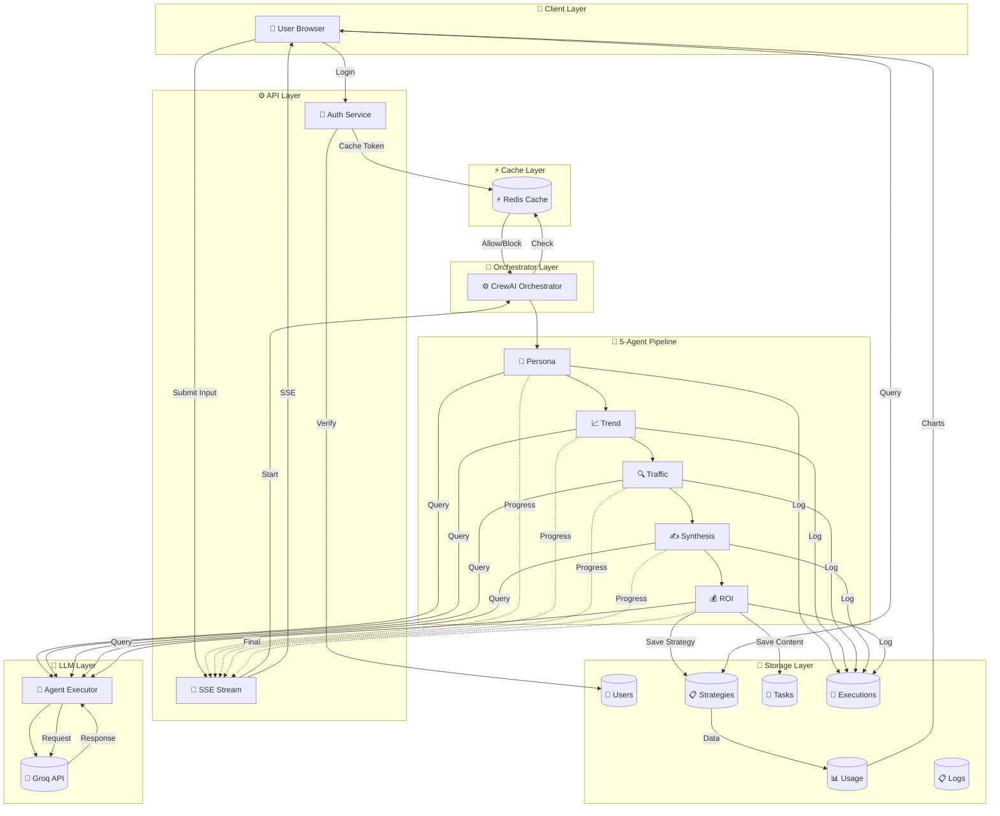
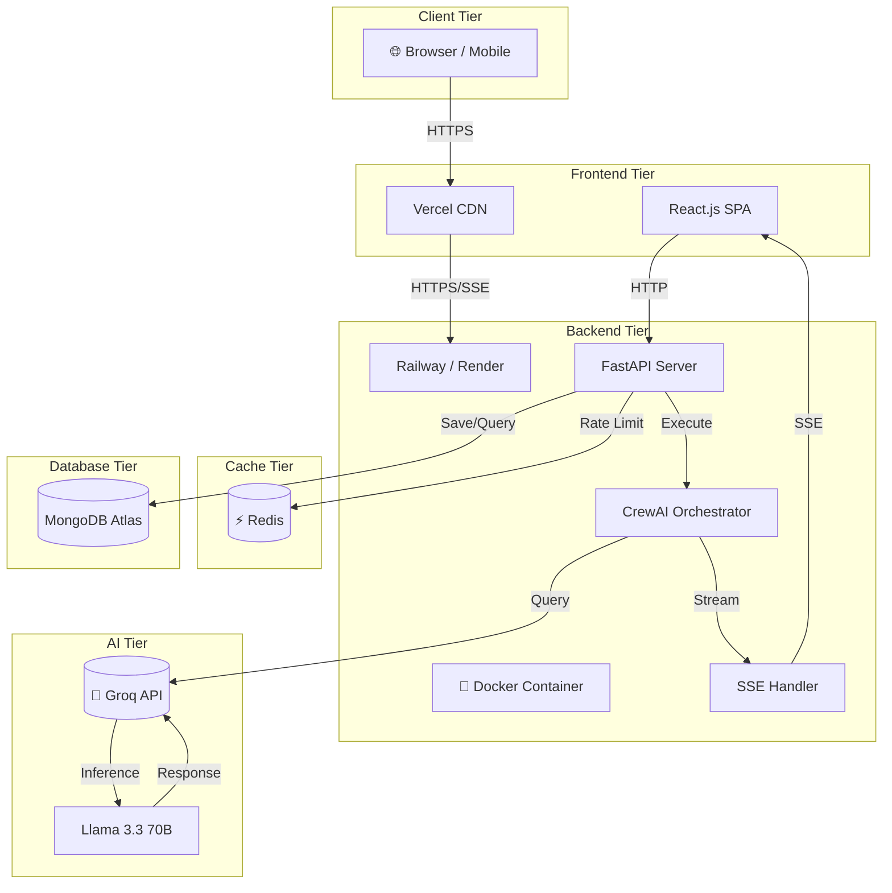

# Database & Data Flow Architecture (planvIx) - CrewAI 5-Agent Pipeline

This document contains the detailed Entity Relationship Diagram (ERD) and Level 1 Data Flow Diagram (DFD) for the Multi AI Agent Content Planner.

These diagrams use Mermaid.js syntax. You can view them by installing a Markdown preview extension that supports Mermaid, or by pasting the code blocks into [Mermaid Live Editor](https://mermaid.live/).

---

## 1. Entity Relationship Diagram (ERD)

This diagram illustrates the core database tables and their relationships within the planvIx system.



### Table Details:

- **Users:** Manages authentication and billing/quotas (interacting with your `security.py` and `rate_limit.py`).
- **Tasks:** Represents a single user request to the Multi-Agent system (e.g., "Write a blog post about AI").
- **Strategies:** Stores the content strategy including target audience, tone, platform, and keywords.
- **CrewAgents:** Defines the 5 CrewAI agents - Persona, Trend, Traffic, Synthesis, ROI.
- **Agent_Executions:** A join/audit table tracking exactly what each agent did for a specific task, useful for the real-time terminal (`AgentTerminal.jsx`).
- **UsageTracking:** Tracks token consumption and request counts per billing period.
- **Content_Plans:** The final, polished output ready for the user's dashboard.
- **System_Logs:** Centralized logging for the python backend (`logger.py`).

---

## 2. Level 0 Context Diagram (DFD)

The Context Diagram defines the boundary between the planvIx system and its external environment.



---

## 3. Level 1 Functional Data Flow Diagram (DFD) - 5 CrewAI Agents

This diagram shows how data moves internally across the different planvIx functional components with the 5-agent CrewAI pipeline.


```

### Process Descriptions:

- **1.0 (Auth & Security):** Handled by `auth_service.py` and `security.py`. Manages registration, session validation, and JWT refreshes.
- **2.0 (CrewAI Orchestrator):** Orchestrated by `crew_orchestrator.py` using CrewAI with 5 sequential agents.
- **3.0 (Agent Execution):** Individual agent interactions with Groq/Llama 3.3 70B.
- **4.0 (Usage & Rate Limiting):** Managed by `UsageService` and Redis for rate limits.
- **5.0 (Analytics Aggregation):** Handled by `AnalyticsService`. Computes charts for dashboards.
- **6.0 (WebSocket/SSE Streaming):** Real-time progress updates and streaming output.

---

## 4. System Architecture Diagram



### System Architecture Notes:

| Tier | Component | Description |
|------|-----------|-------------|
| Client | Browser/Mobile | User accesses the application |
| Frontend | Vercel + React SPA | Global CDN for fast loading |
| Backend | Railway + FastAPI | API server in Docker |
| Cache | Redis | Rate limiting & sessions |
| Database | MongoDB | Persistent storage |
| AI | Groq + Llama 3.3 | LLM inference |
