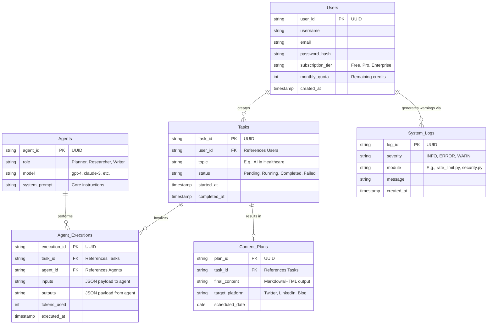
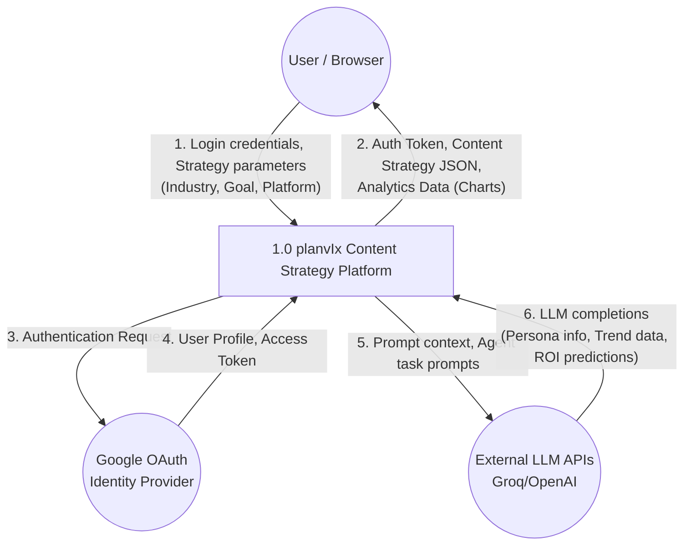

# Database & Data Flow Architecture (planvIx)

This document contains the detailed Entity Relationship Diagram (ERD) and Level 1 Data Flow Diagram (DFD) for the Multi AI Agent Content Planner.

These diagrams use Mermaid.js syntax. You can view them by installing a Markdown preview extension that supports Mermaid, or by pasting the code blocks into [Mermaid Live Editor](https://mermaid.live/).

---

## 1. Entity Relationship Diagram (ERD)

This diagram illustrates the core database tables and their relationships within the planvIx system.



### Table Details:

- **Users:** Manages authentication and billing/quotas (interacting with your `security.py` and `rate_limit.py`).
- **Tasks:** Represents a single user request to the Multi-Agent system (e.g., "Write a blog post about AI").
- **Agents:** Defines the available AI personalities/roles in the system.
- **Agent_Executions:** A join/audit table tracking exactly what each agent did for a specific task, useful for the real-time terminal (`AgentTerminal.jsx`).
- **Content_Plans:** The final, polished output ready for the user's dashboard.
- **System_Logs:** Centralized logging for the python backend (`logger.py`).

---

## 2. Level 0 Context Diagram (DFD)

The Context Diagram defines the boundary between the planvIx system and its external environment.



---

## 3. Level 1 Functional Data Flow Diagram (DFD)

This diagram shows how data moves internally across the different planvIx functional components and MongoDB data stores.

```mermaid
flowchart TD
    %% External Entities
    User((User / Browser))
    LLM_API((External AI APIs))

    %% Data Stores
    D1[(Users DB)]
    D2[(Strategies DB)]
    D3[(Tokens/Auth DB)]
    D4[(Usage Logs)]
    D5[(Redis Cache)]

    %% Processes
    P1[1.0 User Authentication\n& Security]
    P2[2.0 Strategy Orchestration\n(CrewAI Engine)]
    P3[3.0 AI Task Execution\n(Agent Core)]
    P4[4.0 Usage Tracking\n& Quotas]
    P5[5.0 Dashboard Analytics\nAggregation]

    %% Flows: Auth
    User -- "Login Credentials" --> P1
    P1 -- "Verify Profile" --> D1
    P1 -- "Store/Check Tokens" --> D3
    D3 -- "Session Status" --> P1
    P1 -- "Set Token Cache" --> D5

    %% Flows: Strategy Generation
    User -- "Submit Strategy Input" --> P2
    P2 -- "Check Rate Limits" --> D5
    P2 -- "Verify Monthly Quota" --> P4
    P4 -- "Read Usage Counts" --> D1
    
    P2 -- "Dispatch Sub-tasks" --> P3
    P3 -- "API Requests" --> LLM_API
    LLM_API -- "AI Responses" --> P3
    P3 -- "Result Payloads" --> P2
    
    P2 -- "Save Generated Result" --> D2
    P2 -- "Log Agent Token Usage" --> D4
    P2 -- "Update User Count" --> D1
    P2 -- "Stream Output" --> User

    %% Flows: Analytics
    User -- "Request Dashboard Stats" --> P5
    P5 -- "Aggregate Metrics" --> D2
    P5 -- "Fetch Usage Trends" --> D4
    P5 -- "Compute Chart Data" --> User
```

### Process Descriptions:

- **1.0 (Auth & Security):** Handled by `auth_service.py` and `security.py`. Manages registration, session validation, and JWT refreshes.
- **2.0 (Strategy Orchestration):** Orchestrated by `StrategyService` and `StrategyOrchestrator` using **CrewAI**. It breaks inputs into multi-agent tasks.
- **3.0 (AI Task Execution):** Represents the individual agent behaviors (Persona, Trend, Traffic) interacting with Groq/OpenAI.
- **4.0 (Usage & Quotas):** Managed by `UsageService`. It tracks the standard monthly generation limits (e.g., 3 strategies/mo for free tier).
- **5.0 (Analytics Aggregation):** Handled by `AnalyticsService`. It computes MRR, ARPU, and user growth using MongoDB aggregations for the Admin and User dashboards.
