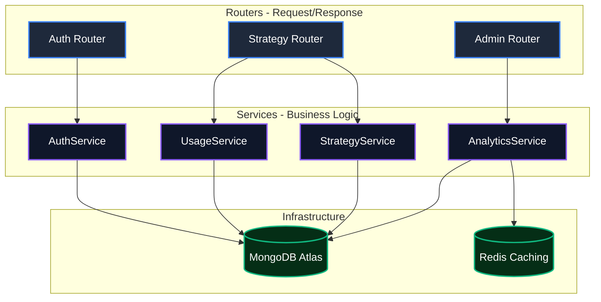

<div align="center">
  <h1><b>🚀 Planvix</b></h1>
  <p>
    <strong>Multi-Agent AI Content Strategy OS</strong>
  </p>
  <p>
    <em>Orchestrating 5 Autonomous Agents to Build Your Entire Marketing Strategy</em>
  </p>

  
  
  
  
</div>

<p align="center">
  <a href="#-about-planvix">🎯 About</a> •
  <a href="#-key-features">✨ Features</a> •
  <a href="#-architecture">🏗️ Architecture</a> •
  <a href="#-industrial-grade-security">🛡️ Security</a> •
  <a href="#-analytics-engine">📊 Analytics</a> •
  <a href="#-quickstart">⚡ Quickstart</a>
</p>

---

## 🎯 About Planvix

**Planvix is a Production-Grade, Internship-Ready Multi-Agent AI Content Strategy OS.** It is built using a modern, scalable architecture designed for real-world startup deployment and high-stakes engineering interviews.

Unlike generic LLM wrappers, Planvix implements a **Decoupled Layered Architecture** (Router → Service → Data) with strict **Role-Based Access Control (RBAC)**, real-time synchronization, and high-performance data processing.

---

## ✨ Key Features (Startup-Grade)

| Feature                       | Industrial Application                                                                            |
| :---------------------------- | :------------------------------------------------------------------------------------------------ |
| **🏗️ Layered Architecture**   | Full separation of concerns using the **Service Pattern**. Clean, testable, and scalable.         |
| **🔒 Enterprise Auth & RBAC** | JWT-based security with claims for `user`, `admin`, and `superadmin`. Backend-enforced filtering. |
| **📊 Analytics Intelligence** | Complex MongoDB Aggregation Pipelines for MRR, Churn, and KPIs. Cached via **Redis** for speed.   |
| **⚡ Real-time WebSockets**   | Live activity feeds and generation status updates using a centralized WebSocket manager.          |
| **🛡️ Global Stability Layer** | React Error Boundaries + Defensive Rendering + Axios Interceptors. **Zero Blank Screens.**        |
| **🤖 Multi-Agent Engine**     | 5 specialized CrewAI agents (Persona, Trend, Traffic, Synthesis, ROI) for tactical depth.         |
| **📈 Intelligence Profiles**  | Per-user billing, token usage tracking, and trend analysis—fully database-driven.                 |

---

---

## 🏗️ Clean Layered Architecture

Planvix follows a strict **Decoupled Architecture** designed for high availability and ease of testing. This structure is a primary talking point for engineering interviews as it demonstrates a deep understanding of the **SOLID principles**.



### Why this architecture?

- **Separation of Concerns**: Business logic is isolated from the HTTP transport layer.
- **Scalability**: Heavy analytics are performed via MongoDB Aggregation Pipelines and cached in Redis.
- **Security**: Centralized **Auth Dependencies** ensure every request is validated before reaching the logic layer.

---

## 🛡️ Industrial-Grade Security

| Security Layer           | Implementation                                                                       |
| :----------------------- | :----------------------------------------------------------------------------------- |
| **🔐 Role-Based Access** | Strict RBAC with `client`, `admin`, and `superadmin` tiers.                          |
| **🎟️ JWT Claims**        | Stateless authentication using signed JWTs with explicit role and expiry data.       |
| **🛑 Rate Limiting**     | SlowAPI integration to prevent brute-force attacks on auth endpoints.                |
| ** Password Hashing**    | `Bcrypt` with salt rounds for production-safe credential storage.                    |
| **🚫 Backend Filtering** | Zero trust for frontend `user_id`. Every filter is extracted from the JWT sub claim. |

---

## 📊 Analytics Engine (High-Performance)

Planvix doesn't just store data; it analyzes it. Our analytics engine is built on **MongoDB Aggregation Pipelines** to provide real-time business intelligence without overloading the application.

- **KPI Metrics**: MRR, ARPU, and Churn calculated on-the-fly.
- **Trend Detection**: Growth trends and AI usage distribution.
- **Redis Caching**: Heavy KPIs are cached for **60 seconds** to ensure sub-100ms response times.

---

## ⚡ Real-Time Synchronization

We use **WebSockets** to provide a "live" feel across the platform:

- **Generation Feed**: Watch agents build your strategy in real-time.
- **Admin Activity**: Live notifications for signups and strategy events.
- **Auto-Reconnect**: Robust frontend socket service with exponential backoff.

---

## ⚡ Quickstart

Get Planvix running in **under 60 seconds**:

### 1️⃣ Clone & Setup

```bash
git clone https://github.com/ayush-lakhani/stratify-ai.git
cd stratify-ai
```

### 2️⃣ Backend (FastAPI + Redis)

```bash
cd backend
python -m venv venv
source venv/bin/activate # or venv\Scripts\activate
pip install -r requirements.txt
python run.py
```

### 3️⃣ Frontend (React + Vite)

```bash
cd frontend
npm install
npm run dev
```

### 4️⃣ Launch

| URL                                 | Purpose                |
| ----------------------------------- | ---------------------- |
| `http://localhost:5173`             | Main app (user-facing) |
| `http://localhost:5173/admin-login` | Admin dashboard login  |
| `http://localhost:8000/docs`        | FastAPI Swagger UI     |

---

## 🛠️ Tech Stack

<div align="center">

### Frontend


### Backend


### Data & AI


</div>

---

## 🔧 Environment Variables

```bash
# .env (backend)
MONGODB_URL=mongodb+srv://...
GROQ_API_KEY=gsk_...
JWT_SECRET_KEY=your-super-secret-key-change-in-production
ADMIN_SECRET=your-admin-secret          # Used to log into /admin-login
REDIS_URL=redis://localhost:6379
PROJECT_NAME=Planvix
VERSION=2.0.0
RATE_LIMIT_PER_MINUTE=30
```

---

## 💳 Pricing

| Tier              | Strategies/Month | Price       | Features                                    |
| :---------------- | :--------------- | :---------- | :------------------------------------------ |
| **🆓 Starter**    | 3                | ₹0          | Core Agents, History Access                 |
| **⭐ Pro**        | Unlimited        | **₹299/mo** | All Agents, Priority Queue, ROI Predictions |
| **🏢 Enterprise** | Custom           | **₹999/mo** | White-label, API Access, Team Seats         |

---

## 📄 License

This project is licensed under the **MIT License**.

---

<div align="center">
  <h3>⚡ LLaMA 3.3 70B • 📊 Enterprise Admin • 🇮🇳 Made in India</h3>
  <p><strong>Developed by Ayush Lakhani</strong></p>
</div>
