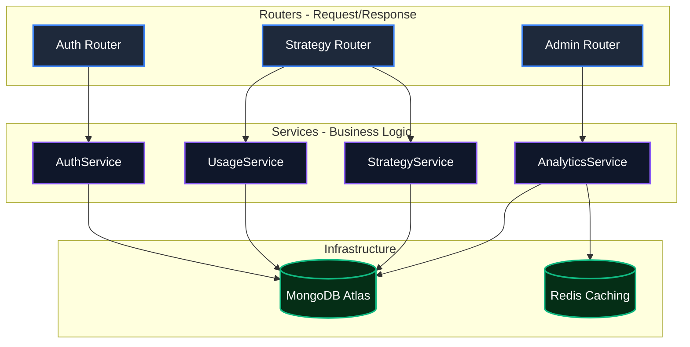

<div align="center">
  <!--  -->
  <h1><b>🚀 planvIx</b></h1>
  <p>
    <strong>Multi-Agent AI Content Strategy OS</strong>
  </p>
  <p>
    <em>Orchestrating 5 Autonomous Agents to Build Your Entire Marketing Strategy</em>
  </p>

  
  
  
  
</div>

<p align="center">
  <a href="#-about-planvix">🎯 About</a> •
  <a href="#-key-features">✨ Features</a> •
  <a href="#-architecture">🏗️ Architecture</a> •
  <a href="#-security-and-stability">🛡️ Security</a> •
  <a href="#-analytics-engine">📊 Analytics</a> •
  <a href="#-agent-orchestration">🤖 Agents</a> •
  <a href="#-quickstart">⚡ Quickstart</a>
</p>

---

## 🎯 About planvIx

**planvIx is a Production-Grade Multi-Agent AI Content Strategy OS.** It is built using a modern, scalable architecture designed for real-world startup deployment and high-stakes engineering rigor.

Unlike generic LLM wrappers, planvIx implements a **Decoupled Layered Architecture** (Router → Service → Data) with strict **Role-Based Access Control (RBAC)**, real-time synchronization via WebSockets, and high-performance data processing powered by Redis and MongoDB.

---

## ✨ Key Features (Startup-Grade)

| Feature                       | Industrial Application                                                                                       |
| :---------------------------- | :----------------------------------------------------------------------------------------------------------- |
| **🏗️ Layered Architecture**   | Full separation of concerns using the **Service Pattern**. Clean, testable, and scalable code.               |
| **🔒 Tiered Auth & RBAC**     | JWT-based User Auth + Google OAuth + `x-admin-secret` for Admin. Tiers: Free (10 req/min), Pro (20 req/min). |
| **📊 Analytics Intelligence** | Complex MongoDB Aggregation Pipelines for MRR, Churn, and KPIs. Cached via **Redis** for sub-100ms response. |
| **⚡ Real-time WebSockets**   | Live agent activity feeds and generation status updates using a centralized WebSocket manager.               |
| **🛡️ Stability Layer**        | React Error Boundaries + Defensive Rendering + Axios Interceptors. **Zero blank screens.**                   |
| **🤖 Multi-Agent Engine**     | 5 specialized CrewAI agents (Persona, Trend, Traffic, Synthesis, ROI) for tactical depth.                    |
| **📈 Intelligence Profiles**  | Per-user billing, token usage tracking, and trend analysis—fully database-driven.                            |

---

## 🏗️ Clean Layered Architecture

planvIx follows a strict **Decoupled Architecture** designed for high availability and ease of testing. This structure ensures that business logic is isolated from transport layers.


```mermaid
graph TD
    classDef router fill:#1e293b,stroke:#3b82f6,stroke-width:2px,color:#fff
    classDef service fill:#0f172a,stroke:#8b5cf6,stroke-width:2px,color:#fff
    classDef data fill:#052e16,stroke:#10b981,stroke-width:2px,color:#fff

    subgraph API_Layer [Routers - Request/Response]
        R1[Auth Router]
        R2[Strategy Router]
        R3[Admin Router]
    end

    subgraph Logic_Layer [Services - Business Logic]
        S1[AuthService]
        S2[UsageService]
        S3[AnalyticsService]
        S4[StrategyService]
    end

    subgraph Data_Layer [Infrastructure]
        M[(MongoDB Atlas)]
        R[(Redis Caching)]
    end

    R1 --> S1
    R2 --> S2
    R2 --> S4
    R3 --> S3
    S1 --> M
    S2 --> M
    S3 --> M
    S3 --> R
    S4 --> M

    class R1,R2,R3 router
    class S1,S2,S3,S4 service
    class M,R data
```

---

## 🤖 Multi-Agent Orchestration

The core of planvIx is a sophisticated **CrewAI** pipeline that sequences five autonomous agents to deliver a comprehensive strategy:

1.  **👤 Persona Agent**: Deep-dives into audience psychology, pain points, and triggers.
2.  **📈 Trend Agent**: Identifies industry gaps, current trends, and unique hook angles.
3.  **🚦 Traffic Agent**: Generates a high-intent discovery pack (SEO keywords & Hashtags).
4.  **🧩 Synthesis Agent**: Bridges insights into a full execution plan and content calendar.
5.  **💰 ROI Agent**: Predicts traffic lift, engagement boost, and validates the final output.

---

## 🛡️ Security & Stability

| Security Layer              | Implementation                                                                                         |
| :-------------------------- | :----------------------------------------------------------------------------------------------------- |
| **🔐 Role-Based Access**    | Strict RBAC with `client`, `admin`, and `superadmin` tiers.                                            |
| **🎟️ Dual-Mode Auth**       | Stateless JWT sessions + Google OAuth integration for seamless onboarding.                             |
| **🛑 Tiered Rate Limiting** | Redis-backed limiting: **10/min (Free)** vs **20/min (Pro)**. Prevents brute-force and resource abuse. |
| **🔑 Admin Shield**         | Custom `x-admin-secret` header validation for administrative endpoints.                                |
| **🔒 Secure Storage**       | Bcrypt password hashing + `sessionStorage` for sensitive keys (cleared on tab close).                  |
| **🚫 Zero-Trust Backend**   | Every request validates the `user_id` from the JWT `sub` claim — never trusting frontend input.        |

---

## 📊 Analytics Engine (High-Performance)

Our admin dashboard provides real-time business intelligence using **MongoDB Aggregation Pipelines**:

- **KPI Tracking**: Live computation of MRR, ARPU, Churn, and growth velocity.
- **Resource Monitoring**: Real-time AI token usage tracking and cost estimation.
- **Intelligent Caching**: Heavy queries cached in Redis with a 60s TTL to ensure sub-100ms latency.
- **Pattern Matching**: Admin filters use case-insensitive regex for robust data retrieval.

---

## 📂 Project Structure

```text
planvIx/
├── backend/                # FastAPI Application
│   ├── app/
│   │   ├── core/           # Security, Logging, Config
│   │   ├── models/         # MongoDB Schemas (Beanie/Pydantic)
│   │   ├── orchestrator/   # CrewAI Multi-Agent Logic
│   │   ├── routers/        # API Endpoints
│   │   └── services/       # Business Logic Layer
│   └── run.py              # Backend Entry Point
├── frontend/               # React + Vite Application
│   ├── src/
│   │   ├── components/     # UI Design System
│   │   ├── pages/          # Dashboard & Analytics
│   │   └── services/       # API & WebSocket Clients
│   └── vite.config.js
└── docs/                   # System Documentation
```

---

## ⚡ Quickstart

### 1️⃣ Clone & Setup

```bash
git clone https://github.com/ayush-lakhani/planvIx.git
cd planvIx
```

### 2️⃣ Backend (FastAPI + Redis)

```bash
cd backend
python -m venv venv
source venv/bin/activate # or venv\Scripts\activate
pip install -r requirements.txt
python run.py
```

### 3️⃣ Frontend (React + Vite)

```bash
cd frontend
npm install
npm run dev
```

---

## 🛠️ Tech Stack

<div align="center">

### Frontend


### Backend


### Data & AI


</div>

---

## 📄 License

This project is licensed under the **MIT License**.

<div align="center">
  <h3>⚡ LLaMA 3.3 70B • 📊 Enterprise Admin • 🇮🇳 Made in India</h3>
  <p><strong>Developed by Ayush Lakhani</strong></p>
</div>
