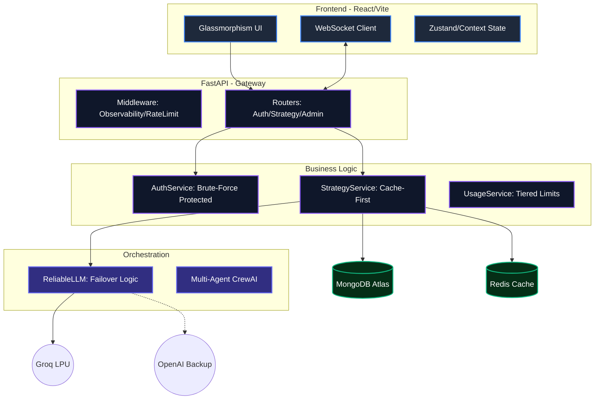

<div align="center">
  <!--  -->
  <h1><b>🚀 planvIx Enterprise</b></h1>
  <p>
    <strong>Multi-Agent AI Content Strategy OS — Highly Scalable SaaS Edition</strong>
  </p>
  <p>
    <em>Orchestrating Autonomous Agents with Enterprise-Grade Reliability & Observability</em>
  </p>

  
  
  
  
</div>

<p align="center">
  <a href="#-about-planvix">🎯 About</a> •
  <a href="#-enterprise-hardening">🛡️ Hardening</a> •
  <a href="#-key-features">✨ Features</a> •
  <a href="#-architecture">🏗️ Architecture</a> •
  <a href="#-agent-orchestration">🤖 Agents</a> •
  <a href="#-quickstart">⚡ Quickstart</a>
</p>

---

## 🎯 About planvIx Enterprise

**planvIx** has been upgraded to a **Highly Scalable SaaS-Grade Architecture**. It now implements extreme engineering rigor to handle production-scale workloads, ensuring zero downtime for AI generations and hardened security for enterprise clients.

---

## 🛡️ Enterprise Hardening (v2.1)

| Pillar | Technology | Business Value |
| :--- | :--- | :--- |
| **AI Resilience** | `ReliableLLM` Failover System | Automatically switches from **Groq** to **OpenAI** if a provider fails. |
| **Observability** | `EnterpriseJSONFormatter` | Structured logging with `request_id` and `user_id` tracing across async boundaries. |
| **Hardened Auth** | Redis Brute-Force Protection | Automatically locks accounts/IPs after 5 failed login attempts for 15 minutes. |
| **Scaling** | Non-Blocking Orchestration | Parallel AI agent execution with real-time progress streaming via WebSockets. |
| **Caching** | Deterministic SHA-256 Caching | Intelligent Redis layer that prevents duplicate AI generations and optimizes costs. |

---

## ✨ Key Features

- **🏗️ Decoupled Layered Architecture**: Strict separation of concern (Router → Service → Data).
- **🔒 Tiered Auth & RBAC**: JWT + Google OAuth + Redis-backed Rate Limiting.
- **⚡ Real-time WebSockets**: Live progress bars and agent activity terminal.
- **📊 Analytics Intelligence**: MongoDB Aggregation Pipelines for business KPIs (MRR, Churn).
- **🛡️ Stability Layer**: Global Error Boundaries + Defensive Rendering + Performance Tracking Middleware.

---

## 🏗️ System Architecture


```mermaid
graph TD
    classDef router fill:#1e293b,stroke:#3b82f6,stroke-width:2px,color:#fff
    classDef service fill:#0f172a,stroke:#8b5cf6,stroke-width:2px,color:#fff
    classDef data fill:#052e16,stroke:#10b981,stroke-width:2px,color:#fff
    classDef ai fill:#312e81,stroke:#6366f1,stroke-width:2px,color:#fff

    subgraph Client_Layer [Frontend - React/Vite]
        UI[Glassmorphism UI]
        WS_C[WebSocket Client]
        Store[Zustand/Context State]
    end

    subgraph API_Layer [FastAPI - Gateway]
        MW[Middleware: Observability/RateLimit]
        RT[Routers: Auth/Strategy/Admin]
    end

    subgraph Service_Layer [Business Logic]
        AuthS[AuthService: Brute-Force Protected]
        StratS[StrategyService: Cache-First]
        UsageS[UsageService: Tiered Limits]
    end

    subgraph AI_Engine [Orchestration]
        ReliableLLM[ReliableLLM: Failover Logic]
        Agents[Multi-Agent CrewAI]
    end

    UI --> RT
    WS_C <--> RT
    RT --> AuthS
    RT --> StratS
    StratS --> ReliableLLM
    ReliableLLM --> Groq((Groq LPU))
    ReliableLLM -.-> OpenAI((OpenAI Backup))
    
    StratS --> M[(MongoDB Atlas)]
    StratS --> R[(Redis Cache)]

    class UI,WS_C,Store router
    class MW,RT service
    class AuthS,StratS,UsageS service
    class ReliableLLM,Agents ai
    class M,R data
```

---

## ⚡ Quickstart

### 1️⃣ Requirements
- **Python 3.11+**
- **Node.js 18+**
- **Redis Server**
- **MongoDB Instance**

### 2️⃣ Configuration
Create a `.env` in the `backend/` folder:
```env
MONGODB_URL=your_mongo_url
REDIS_URL=your_redis_url
JWT_SECRET_KEY=your_secret
GROQ_API_KEY=your_primary_key
OPENAI_API_KEY=your_failover_key
```

### 3️⃣ Installation
```bash
# Backend
cd backend && pip install -r requirements.txt && python run.py

# Frontend
cd frontend && npm install && npm run dev
```

---

<div align="center">
  <h3>⚡ LLaMA 3.3 70B • 📊 Enterprise Admin • 🛡️ Production Hardened</h3>
  <p><strong>Developed by Ayush Lakhani</strong></p>
</div>
