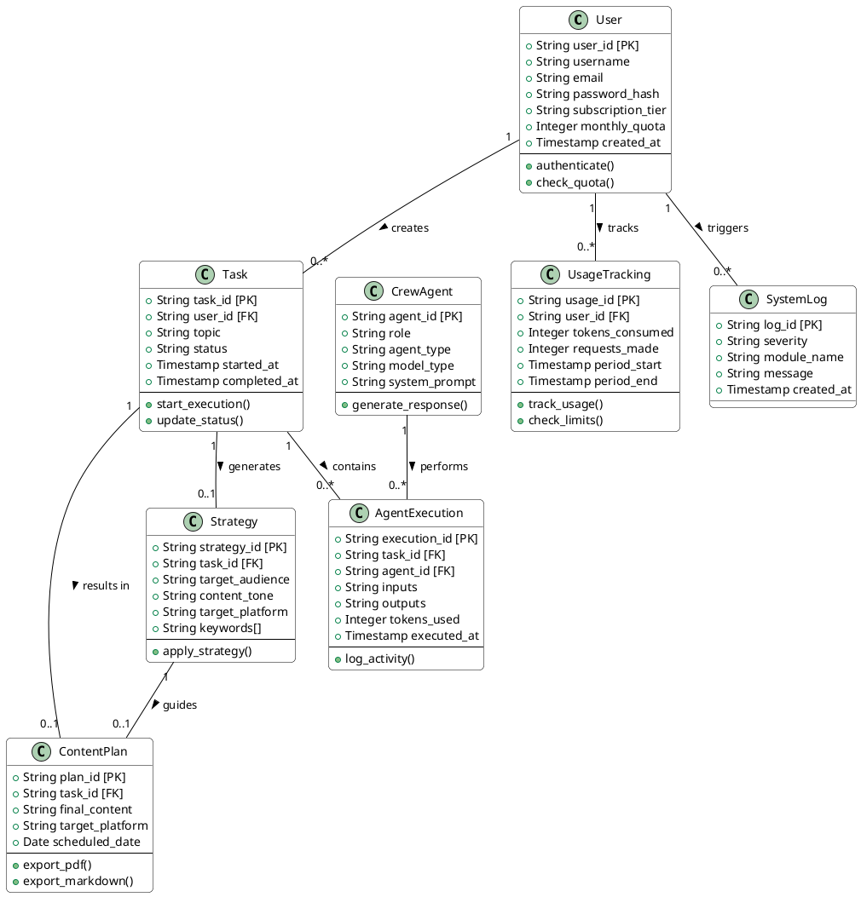
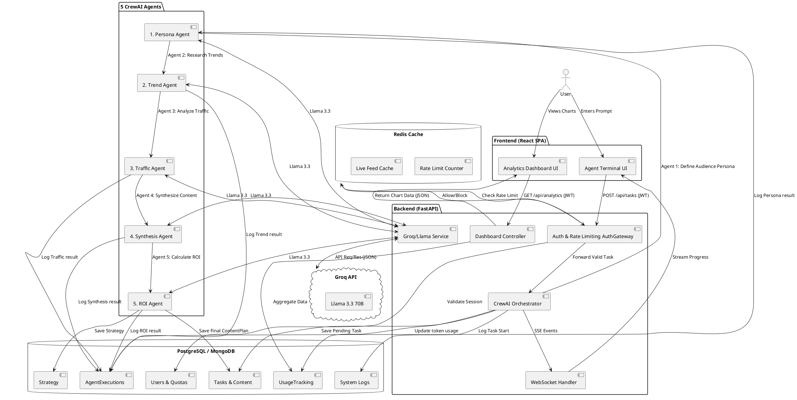

# UML Diagrams: Multi AI Agent Content Planner (planvIx) - CrewAI 5-Agent Pipeline

Below are the **UML Class Diagram** (for the database schema representing the ERD), the **UML Activity/Component Diagram** (representing DFD Level 1), and the **UML Deployment Diagram** (representing the System Architecture).

You can render these diagrams using **PlantUML**. You can copy each `@startuml ... @enduml` block and paste it directly into an online viewer like [PlantText](https://www.planttext.com/) or the [PlantUML Web Server](http://www.plantuml.com/plantuml/uml/).

---

## 1. UML Class Diagram (ERD Representation)

This diagram object-orients your database tables, showing their attributes (columns) and relationships (foreign keys).



---

## 2. UML Component/Data Flow Diagram (DFD Level 1) - 5 CrewAI Agents

This diagram shows how the system components interact and pass data to each other, representing the flow of information with the 5-agent CrewAI pipeline.



---

## 3. UML Deployment Diagram (System Architecture)

This diagram maps your software architecture onto the physical (or virtual) servers where they will run.

```plantuml
@startuml
node "User Device (Browser / Mobile)" <<Client Node>> {
  node "Web Browser" {
    artifact "React.js SPA Bundle" {
        component "AgentTerminal.jsx"
        component "RevenueAndUserCharts.jsx"
        component "index.css"
    }
  }
}

node "Vercel (Frontend)" <<CDN Node>> {
  component "React SPA Hosting"
}

node "Railway/Render (Backend)" <<Server Node>> {
  node "Docker Container" {
    node "Python Runtime (FastAPI)" {
        component "middleware.py" as middleware
        component "security.py" as security
        component "rate_limit.py" as ratelimit
        component "logger.py" as logger
        component "crew_orchestrator.py" as orchestrator
        component "WebSocket Handler" as ws_handler

        middleware --> security
        middleware --> ratelimit
        orchestrator --> logger
    }
  }
}

node "Redis (Rate Limiting)" <<Cache Node>> {
    database "Redis Instance"
}

node "Database Server" <<Database Node>> {
  database "PostgreSQL" {
    collections "Users, Tasks, Strategy, AgentExecutions, UsageTracking, SystemLogs"
  }
}

cloud "Groq API" {
  node "Llama 3.3 70B" <<AI Provider>>
}

' Connections
"React.js SPA Bundle" --(0 "HTTPS / SSE" Vercel
Vercel --(0 "HTTPS / WebSocket" Railway/Render
Railway/Render --(0 "Redis Protocol" Redis
Railway/Render --(0 "DB Driver (TCP/IP)" PostgreSQL
orchestrator --(0 "HTTPS (JSON)" Llama 3.3 70B

note right of "React.js SPA Bundle"
  Presentation Layer handling
  state and visualization
end note

note right of "Docker Container"
  Application Layer handling
  CrewAI 5-agent orchestration
end note

note right of "Redis"
  Caching layer for rate limiting
  and live feed streaming
end note

@enduml
```
