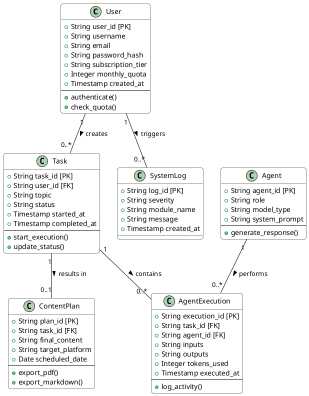
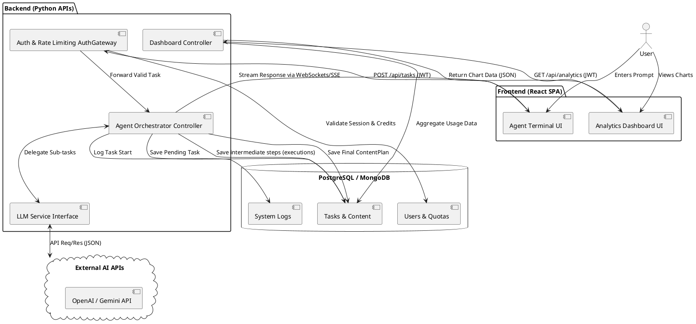
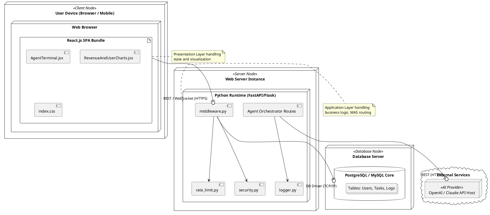

# UML Diagrams: Multi AI Agent Content Planner (planvIx)

Below are the **UML Class Diagram** (for the database schema representing the ERD), the **UML Activity/Component Diagram** (representing DFD Level 1), and the **UML Deployment Diagram** (representing the System Architecture).

You can render these diagrams using **PlantUML**. You can copy each `@startuml ... @enduml` block and paste it directly into an online viewer like [PlantText](https://www.planttext.com/) or the [PlantUML Web Server](http://www.plantuml.com/plantuml/uml/).

---

## 1. UML Class Diagram (ERD Representation)

This diagram object-orients your database tables, showing their attributes (columns) and relationships (foreign keys).

---

## 2. UML Component/Data Flow Diagram (DFD Level 1)

This diagram shows how the system components interact and pass data to each other, representing the flow of information.

---

## 3. UML Deployment Diagram (System Architecture)

This diagram maps your software architecture onto the physical (or virtual) servers where they will run.

